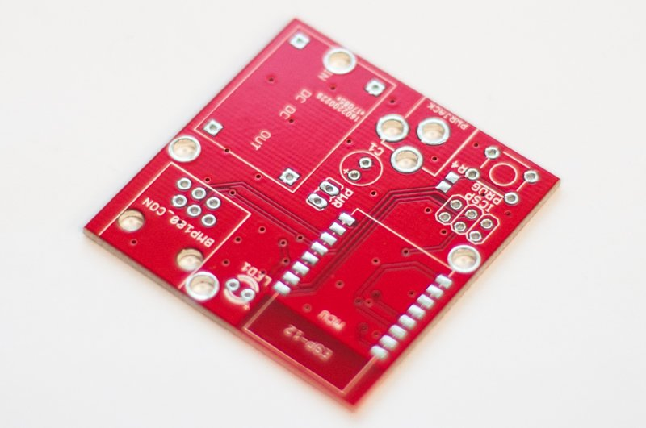
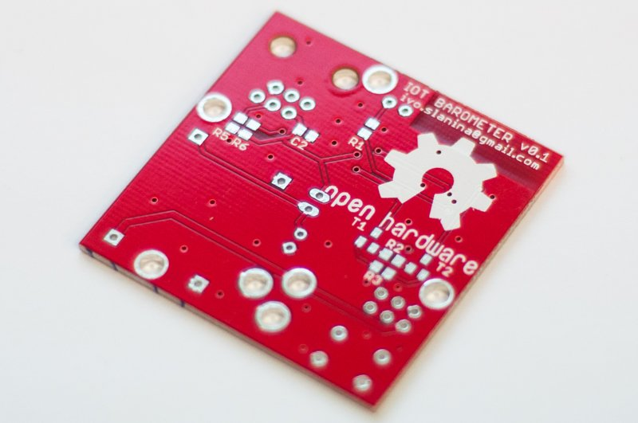

# ESP8266 Node PCB

Design of esp8266 board PCB. This should be base design for esp8266 IoT devices.

## Features

 - Powered by mini DC-DC power supply module ([LM2596](http://www.ti.com/lit/ds/symlink/lm2596.pdf) chip).
 - 5.5 mm center positive jack.
 - On-board programming connector.
 - Programming push button.
 - Jumper for enabling power supply module.
 - RJ-11 connector for connecting various sensors.
 - Notification LED.
 - Intended to be manufactured by [dirtypcbs.com](http://dirtypcbs.com/).

## Images

